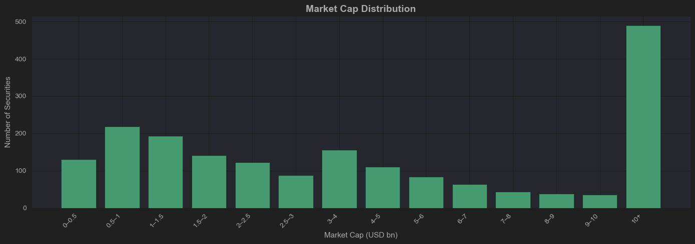

# msc_project_a
MSc project Predicting stock price movements using sentiment data

# QUESTIONS FOR ALESSANDRO
1.  Should I be creating pretty looking notebooks with every command and result with  
commentary? - or just ones I deem to be important?
2. 

# CURRENT POINT IN PROJECT:  
1. Trying to find best way to match up isins and tickers. Look for parent company field as a next option.  
2. Look at file US_tickerlist3.xlsx and continue from there. Maybe all erroneous ones might not have a _US after their found tickers?

Total raw file lines: 40,473,352  
Countries: ['USA' 'CAN' 'MEX']

Min date: 2000-01-01 02:56:05.000  
Max date: 2025-06-30 23:53:35.220

Country
USA    37445514  
CAN     2937242  
MEX       90596  

Filter by date > 2018-01-01... rows of US data = 8,679,192
2738 days of data (appox 2738 / 365 = 7.5 years - about from from beginning of 2018 to half way through 2025.)  

A quick bar graph showing the headline counts per month for the entire 7.5 year period.
Minium monthly number of headlines: 64987
Maximum monthly number of headlines: 141913
Average monthly number of headlines: 96435

Matching up ISINs and tickers has taken much longer than expected and Bloomberg throttled my api data usage. I managed to do a signifcant  
amount of the isin and ticker matching inside BQuant as this was sandboxed to achieve a good data field for 1,911 securities to now begin the mkt_cap  
and turnover filters... 

The distribution of mkt_cap in USD billions.

The distribution of daily turnover in USD millions

Using stock market trading experience which is backed up by current research a market cap filter minimum of $1bln and a turnover  
minimum of $5m per day (Gu et al 2020) will be applied to the stock universe to ensure minimum market impact and reduction of  
trading spreads. The impact on the numbers of securities are below:  
Number of separate securities: 1911 before filters applied. 
Number of securities by mkt cap filter only  1562.  
Number of securities by turnover filter only: 1609.  
Number of securities by both filters: 1469.    

