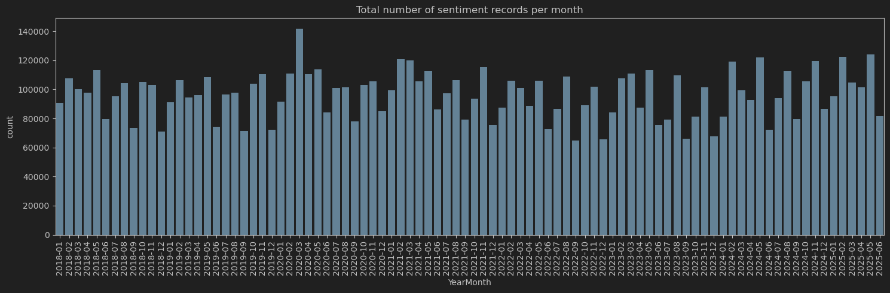
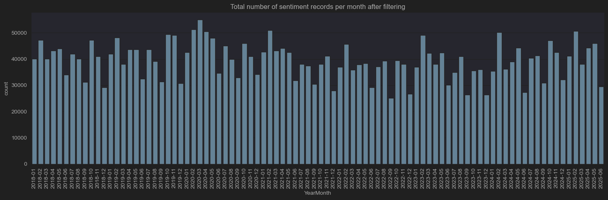
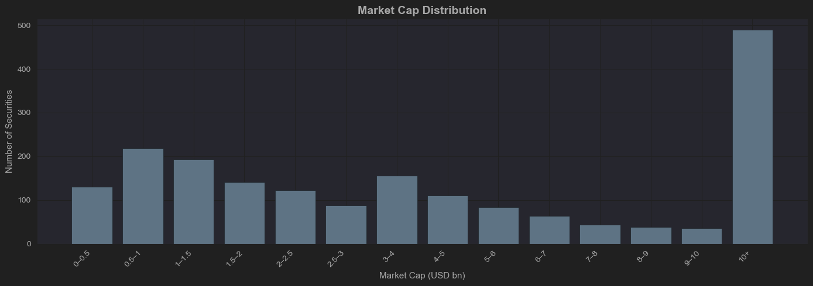
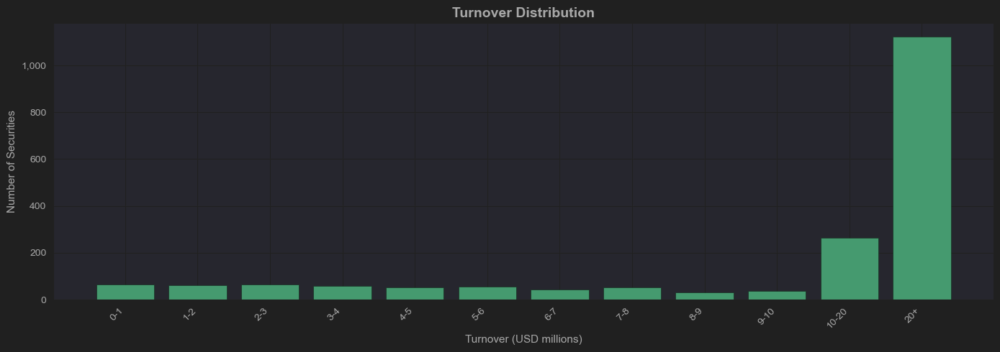
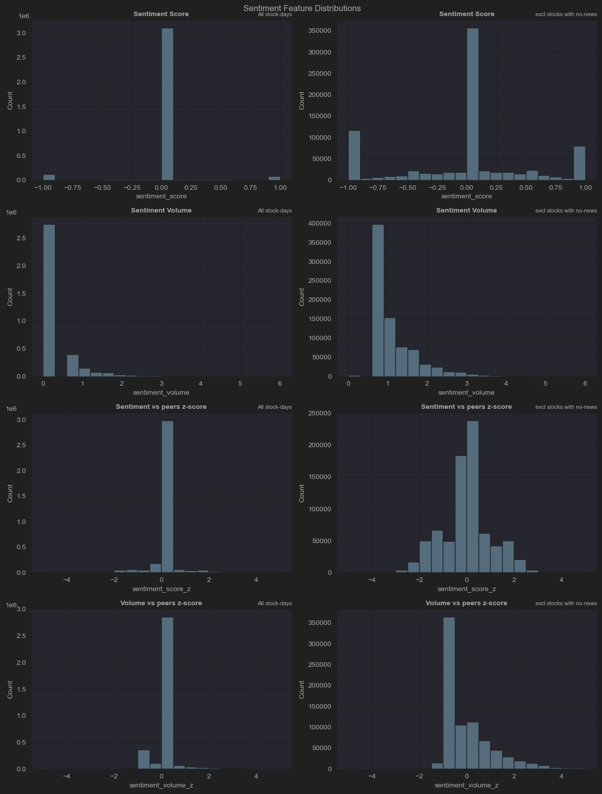

# msc_project_a
MSc project Predicting stock price movements using sentiment data  
Data Science, Birkbeck University  
September 2026.  

## Data Availability:  
Stock price data is proprietary and not included in the repo. Available from Bloomberg.  
Sentiment data is proprietary and not included in the repo. Available from Alexandria Technology.  

## Requirements:  
Python version 3.12.  
Key libraries:  
1. pandas  
2. numpy  
3. scikit-learn  
4. statsmodels  
5. scipy  
6. pandas_market_calendars  


# ORDER OF PLAY

1. load_raw_sentiment.ipynb  
2. prep_tickers_for_bberg.ipynb  
3. filter_mktcap.ipynb  
4. get_price_data.ipynb  
5. sentiment_timestamp_adjustment.ipynb  
6. daily_sentiment_aggregation.ipynb  
7. price_feature_construction.ipynb  
8. merge_frames.ipynb
9. ADF_testing.ipynb using adf_testing.py 
10. train_test_split.ipynb using train_test_split.py  
11. 11_var_lag_selection.py  
12. 12_granger_testing.py  
13. 12b_granger_testing_HB.py  
14. 13_lasso_testing.py  
15. 14_rf_testing.py  
16. rf_all_tgts.ipynb  


## Development Notes and images   

```
Total raw file lines: 40,473,352  
Countries: ['USA' 'CAN' 'MEX']

Min date: 2000-01-01 02:56:05.000  
Max date: 2025-06-30 23:53:35.220

Country
USA    37445514  
CAN     2937242  
MEX       90596  

Filter by date > 2018-01-01... rows of US data = 8,679,192
2738 days of data (appox 2738 / 365 = 7.5 years - about from from beginning of 2018 to half way through 2025.)  

A quick bar graph showing the headline counts per month for the entire 7.5 year period.
Minium monthly number of headlines: 64987
Maximum monthly number of headlines: 141913
Average monthly number of headlines: 96435  
```


 

After Filtering for market cap and turnover we were left with 1,469 securities. This is how the sentiment headlines look after this filter  



Minium monthly number of headlines: 25176
Maximum monthly number of headlines: 55018
Average monthly number of headlines: 39408.96666666667


Matching up ISINs and tickers has taken much longer than expected and Bloomberg throttled my api data usage. I managed to do a signifcant  
amount of the isin and ticker matching inside BQuant as this was sandboxed to achieve a good data field for 1,911 securities to now begin the mkt_cap  
and turnover filters... 

The distribution of mkt_cap in USD billions.



The distribution of daily turnover in USD millions



Using stock market trading experience which is backed up by current research a market cap filter minimum of $1bln and a turnover  
minimum of $5m per day (Gu et al 2020) will be applied to the stock universe to ensure minimum market impact and reduction of  
trading spreads. The impact on the numbers of securities are below:  
Number of separate securities: 1911 before filters applied. 
Number of securities by mkt cap filter only  1562.  
Number of securities by turnover filter only: 1609.  
Number of securities by both filters: 1469.    

Prices downloaded from Bloomberg inside their BQNT sandbox - prices copied and pasted into .txt file.

Fix nan prices. I had to backwards fill 65 securties who's missing values happened to be before their first listing date. Backfilling from here was  
was the right fix.

# Next task was to move sentiment data from non-trading days.  
I realised there were actually three things to do:
1. Adjust/Translate time from UTC to EST (New York).
2. Move any data that occurred after 4pm NY time to the next trading day and apply the timestamp as 00:01:00. 
3. Move any data that occurred on an non-trading day (weekend or holiday) to the next trading day and apply the timestamp as 00:01:00

# Calcualte daily sentiment measures.  
1. For reasoning and structure of the 4 built measures refer to the file in .idea folder. You need to explain why choosing  
the specific features took longer than expected with respect to not trying to lose information.
2. no. stocks 1,469.  
3. 3,540,016 of sentiment based headlines after stock universe has been filtered.  
4. Stock-days with news   : 795,363 (22.5% of skeleton) - show most days there is no news.  
5. Distribution of Feature distributions  
6. 
 

# Calculate pricing measures.  
```
1. Lot's of reasoning and justification behind why you chose the features.  
2. End result: final panel 2,408,260 rows × 1,469 ISINs; seven features and six targets with their describes; the exact-multiple NaN arithmetic; winsorisation rates (0.47% price z, plus the Sector_z20 rate when you run it); the BIG/SBNY pair as the truncation rule's two-sided exhibit; and the before/after pvma story (−9.05 artefact → −6.63 genuine).  
3. |       |       fwd_r1 |       fwd_r3 |       fwd_r5 |   fwd_r1_sec |   fwd_r3_sec |   fwd_r5_sec |
|:------|-------------:|-------------:|-------------:|-------------:|-------------:|-------------:|
| count |  2.40679e+06 |  2.40385e+06 |  2.40092e+06 |  2.40678e+06 |  2.40384e+06 |  2.40091e+06 |
| mean  |  0.000106456 |  0.000310142 |  0.000509311 | -1.24548e-21 | -1.99521e-20 |  1.73869e-20 |
| std   |  0.0276095   |  0.0473081   |  0.0606162   |  0.0223825   |  0.0383725   |  0.0490669   |
| min   | -6.28872     | -6.28872     | -6.54844     | -6.30308     | -6.30397     | -6.48379     |
| 25%   | -0.0108584   | -0.019091    | -0.0247756   | -0.00842671  | -0.0150653   | -0.0197804   |
| 50%   |  0.00051386  |  0.00144474  |  0.0023307   |  0.000128427 |  0.000259588 |  0.000405832 |
| 75%   |  0.0115431   |  0.0210633   |  0.0279674   |  0.00860702  |  0.0155277   |  0.020562    |
| max   |  1.70181     |  1.91316     |  2.96294     |  1.70368     |  1.85575     |  2.91571     |

```
# ADF testing.  
1. All stats passed stationarity tests:
Loaded MODEL_DATASET: 2,370,189 rows, 1,469 unique ISINs

Saved per-series results: 26,445 rows -> P:\Personal\Birkbeck\MSc Project\git_msc_project_a\data\processed\adf_results_1.parquet
```
=== ADF summary: per-stock variables ===
               var  n_tested  n_skipped  reject_rate_5pct  median_pvalue   mw_stat  mw_pvalue
                r0      1454         15                 1       9.81e-27 5.991e+05          0
               r_1      1454         15                 1      9.962e-27 6.053e+05          0
             r_5_2      1454         15            0.9972       5.68e-13 7.696e+04          0
            r_10_6      1454         15            0.9938      1.047e-11 6.894e+04          0
              pvma      1452         17            0.9938      9.744e-14 8.492e+04          0
            r0_z20      1452         17                 1      6.936e-25 5.445e+05          0
        Sector_z20      1452         17            0.9848      1.616e-07 4.353e+04          0
            fwd_r1      1454         15                 1      9.777e-27 6.018e+05          0
            fwd_r3      1453         16            0.9966      5.708e-13 7.692e+04          0
            fwd_r5      1453         16            0.9911      1.079e-11 6.884e+04          0
        fwd_r1_sec      1454         15                 1              0 1.288e+06          0
        fwd_r3_sec      1453         16            0.9959        1.5e-12 7.485e+04          0
        fwd_r5_sec      1453         16            0.9931      6.268e-11 6.475e+04          0
   sentiment_score      1454         15            0.9993      4.301e-29 8.854e+05          0
  sentiment_volume      1454         15            0.9945      3.178e-25 4.859e+05          0
 sentiment_score_z      1454         15                 1      2.072e-30 1.056e+06          0
sentiment_volume_z      1454         15            0.9972              0 1.308e+06          0
       story_count      1454         15            0.9966              0  1.28e+06          0

=== ADF results: universe variables ===
                      var status  nobs  adf_stat    pvalue  usedlag
 universe_sentiment_score     ok  1866    -9.325 9.678e-16       14
universe_sentiment_volume     ok  1855    -7.933 3.472e-12       25
     universe_story_count     ok  1861    -9.117 3.289e-15       19

=== Skipped series by reason ===
               var    status  count
        Sector_z20 too_short     17
            fwd_r1 too_short     15
        fwd_r1_sec too_short     15
            fwd_r3 too_short     16
        fwd_r3_sec too_short     16
            fwd_r5 too_short     16
        fwd_r5_sec too_short     16
              pvma too_short     17
                r0 too_short     15
            r0_z20 too_short     17
               r_1 too_short     15
            r_10_6 too_short     15
             r_5_2 too_short     15
   sentiment_score too_short     15
 sentiment_score_z too_short     15
  sentiment_volume too_short     15
sentiment_volume_z too_short     15
       story_count too_short     15
```

# Train_test_split  
```
Simple code to split the dataset at 70/30. The script train_test_split.py returns a dict of the  
split dates. There is also a buffer of 6 dates to prevent forward pricing leaching into the test set. Using the 70/30  
code these are the results:
train_date_start 2018-01-04 00:00:00
train_date_end 2023-03-30 00:00:00
test_date_start 2023-04-10 00:00:00
test_date_end 2025-06-30 00:00:00
```
# Vector Autoregressions (VAR) - find the best lags.  
Results:  

Training window: 2018-01-04 to 2023-03-30
Rows: 1,677,998 | Stocks: 1,461

Saved per-stock results to: P:\Personal\Birkbeck\MSc Project\git_msc_project_a\data\processed\var_lag_results_1.parquet

```
--- Status summary ---
status
ok             1391
too_few_obs      70

```
```
Successful fits: 1,391 of 1,461 stocks


-- Var results (modal | median) --  
  AIC: 10 | 10.0  
  HQIC: 6 | 6.0  
  BIC:  2 | 2.0  

-- BIC-selected lag distribution --  
  lag  0:   7 stocks (  0.5%)  
  lag  1:   118 stocks (  8.5%)  
  lag  2:   1,176 stocks ( 84.5%)  
  lag  5:   88 stocks (  6.3%)  
  lag  6:   2 stocks (  0.1%)  
```

# Granger Testing
```
Results:
C:\Users\m.byrom\AppData\Local\miniconda3\envs\msc_1\python.exe "P:\Personal\Birkbeck\MSc Project\git_msc_project_a\scripts\12_granger_testing.py" 
Training panel: 1,677,998 rows, 1,461 ISINs, 2018-01-04 to 2023-03-30
Tests completed: 6,950 | Skips/failures logged: 71
Saved 6,950 test results to P:\Personal\Birkbeck\MSc Project\git_msc_project_a\data\processed\granger_results_1.parquet

Skip summary:
reason
insufficient rows (183)    3
insufficient rows (188)    2
insufficient rows (145)    2
insufficient rows (182)    2
insufficient rows (45)     2
insufficient rows (27)     2
insufficient rows (187)    2
insufficient rows (212)    2
insufficient rows (191)    2
insufficient rows (189)    2
insufficient rows (105)    2
insufficient rows (150)    1
insufficient rows (229)    1
insufficient rows (205)    1
insufficient rows (80)     1
insufficient rows (214)    1
insufficient rows (211)    1
insufficient rows (7)      1
insufficient rows (22)     1
insufficient rows (28)     1
insufficient rows (62)     1
insufficient rows (230)    1
insufficient rows (71)     1
insufficient rows (195)    1
insufficient rows (249)    1
insufficient rows (181)    1
insufficient rows (206)    1
insufficient rows (244)    1
insufficient rows (136)    1
insufficient rows (69)     1
insufficient rows (164)    1
insufficient rows (106)    1
insufficient rows (180)    1
insufficient rows (141)    1
insufficient rows (168)    1
insufficient rows (85)     1
insufficient rows (160)    1
insufficient rows (193)    1
insufficient rows (231)    1
insufficient rows (126)    1
insufficient rows (221)    1
insufficient rows (100)    1
insufficient rows (235)    1
insufficient rows (107)    1
insufficient rows (158)    1
insufficient rows (125)    1
insufficient rows (142)    1
insufficient rows (103)    1
insufficient rows (227)    1
insufficient rows (174)    1
insufficient rows (43)     1
insufficient rows (56)     1
insufficient rows (234)    1
insufficient rows (130)    1
insufficient rows (19)     1
insufficient rows (113)    1
insufficient rows (128)    1
insufficient rows (246)    1
insufficient rows (216)    1
Name: count, dtype: int64

=== Granger causality: rejection rates across the universe ===
(Chance baseline under H0: ~1%, ~5%, ~10% respectively)

                           n_stocks  median_p  rej_1pct  rej_5pct  rej_10pct
test                                                                        
universe_sentiment_volume      1390    0.1508    0.0590    0.2345     0.3849
joint_all_sentiment            1390    0.2758    0.0518    0.1597     0.2583
sentiment_volume_z             1390    0.4278    0.0281    0.0971     0.1712
sentiment_score_z              1390    0.4990    0.0223    0.0691     0.1194
universe_sentiment_score       1390    0.5736    0.0007    0.0129     0.0424

Process finished with exit code 0

```


# Struggles / Weaknesses / Further things to develop  
1. Time it took for ticker / ISIN matching - historical data is tough to work with.  
2. API throttle. Meant lot's of copying and pasting from BQNT. Explain how you batch saved.  
3. Creating the features when grouping the days took much longer than expected. Had to check and fix one situation where all the weekends inadvertantly  
got added back into the daily sentiment skeleton framework and therefore increasing the number of non-news days - this took time to identify and fix.  
It might be that we could have combined the measures in a different way and therefore reduced information loss when aggregating.
3. Given we had daily closing prices we had to aggregate the sentiment to daily summaries. However, with greater detail we could have potentially  
traded on a market open for news that was out before the open - maybe this is achievable?  